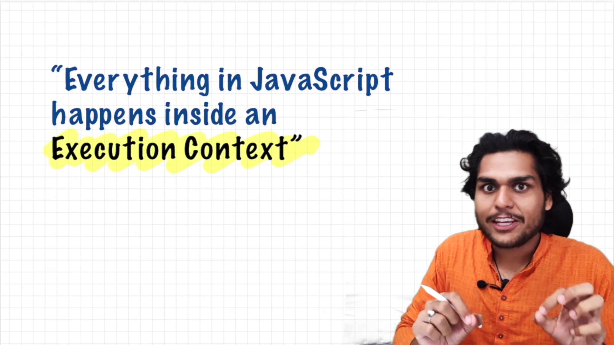
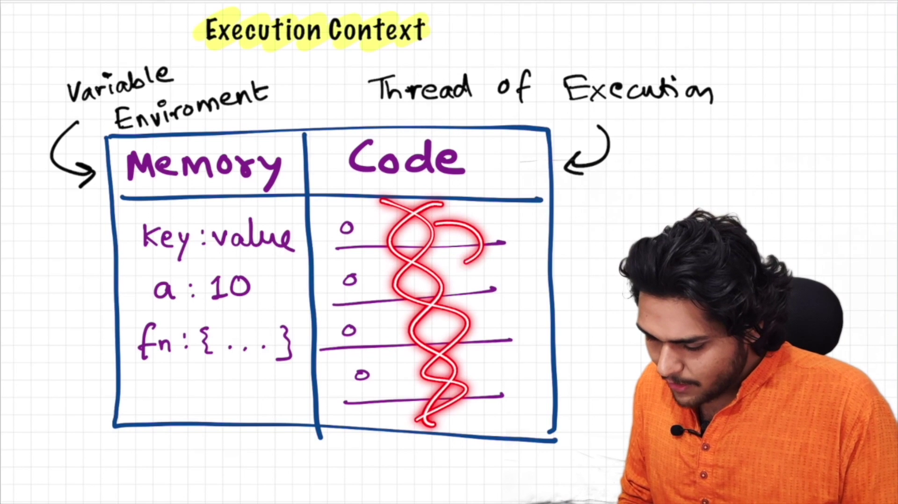
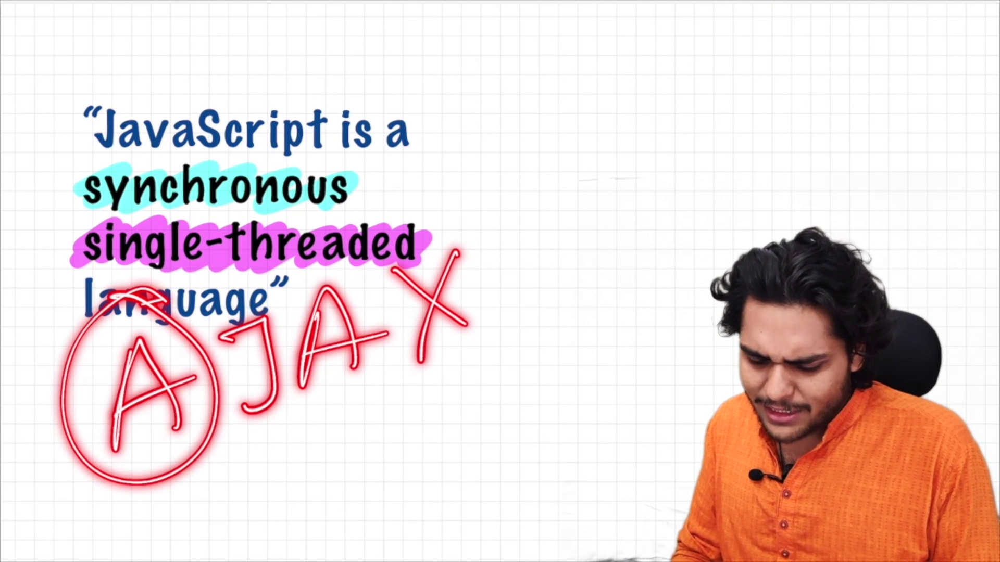

# How JavaScript Works 🔥& Execution Context

In JavaScript everything executed inside a **Execution Context**. where all the JS code live and executed.

1. Variable Environment - where all the variables, functions are stored as key value pairs
2. Thread of Execution - where instructions are executed one by one.

- JS executes one instructions at a time -> Single Threaded
- JS executes one by one in order is -> Synchronous

If JS is Synchronous and Single Threaded, how Asynchronous work ?
