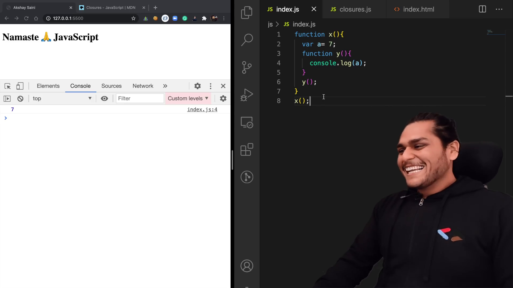
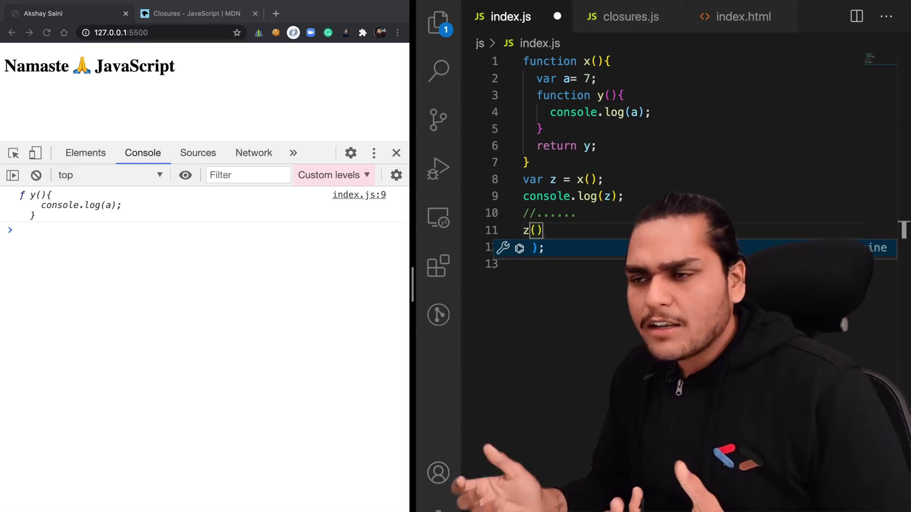
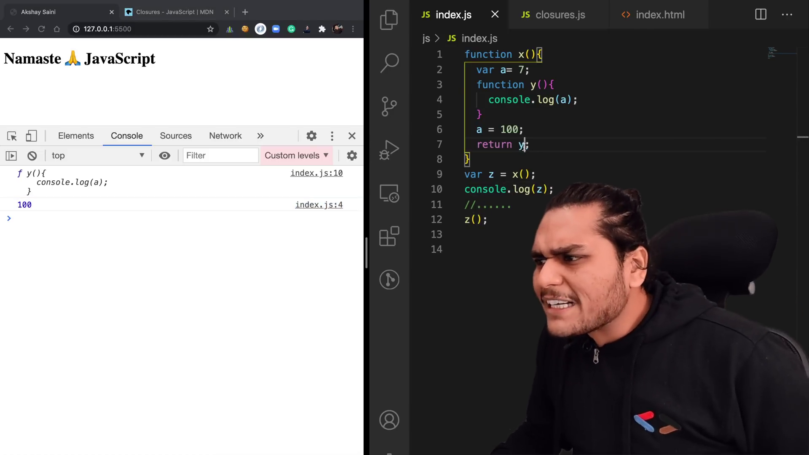
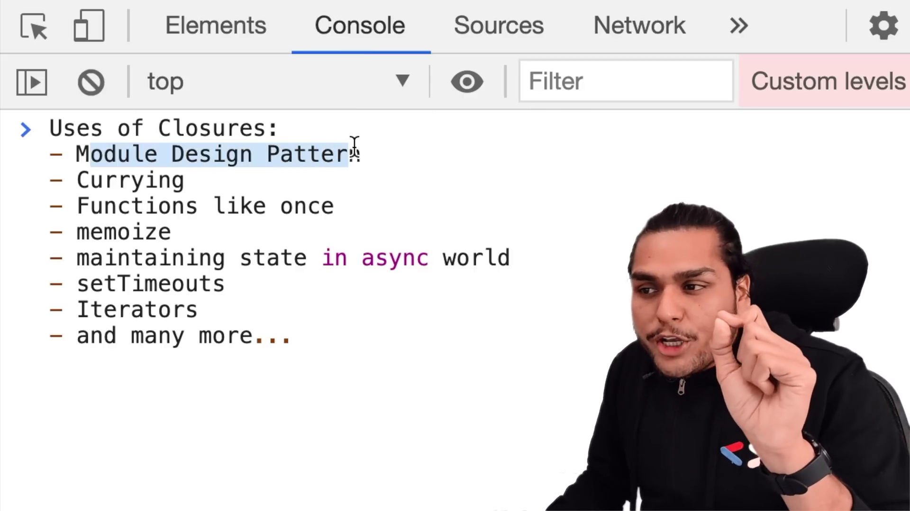

# Closures in JS 🔥

- **Closures** is function along with its lexical environment
- when you return the function from closure, it becomes complicated, it not only return the function, but return lexical environment also. so that it remembers when we call the returned function.
- Closures comes with **Gotcha**

