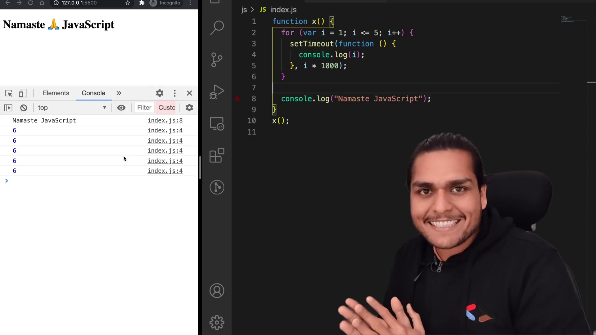
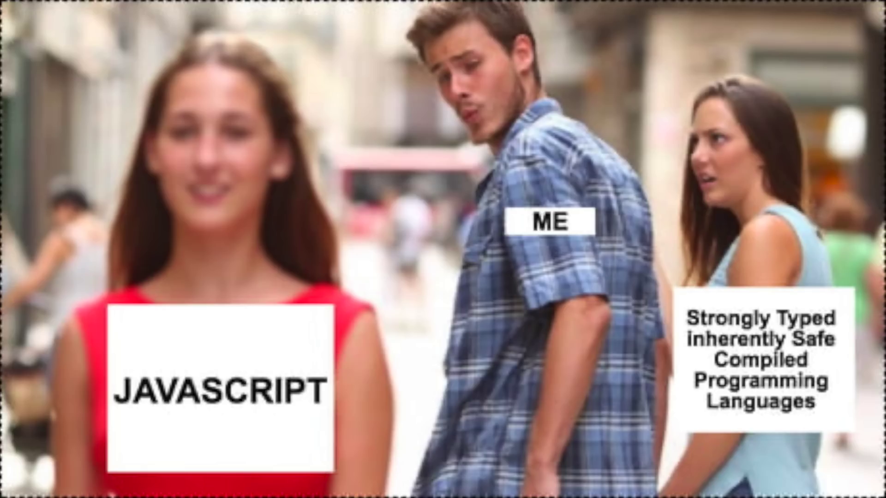

# setTimeout + Closures Interview Question 🔥

- setTimeout - takes the callback function and timer, once time expired
  it put callback function in callstack
- let makes new variable in block scope, where var refer to same location

