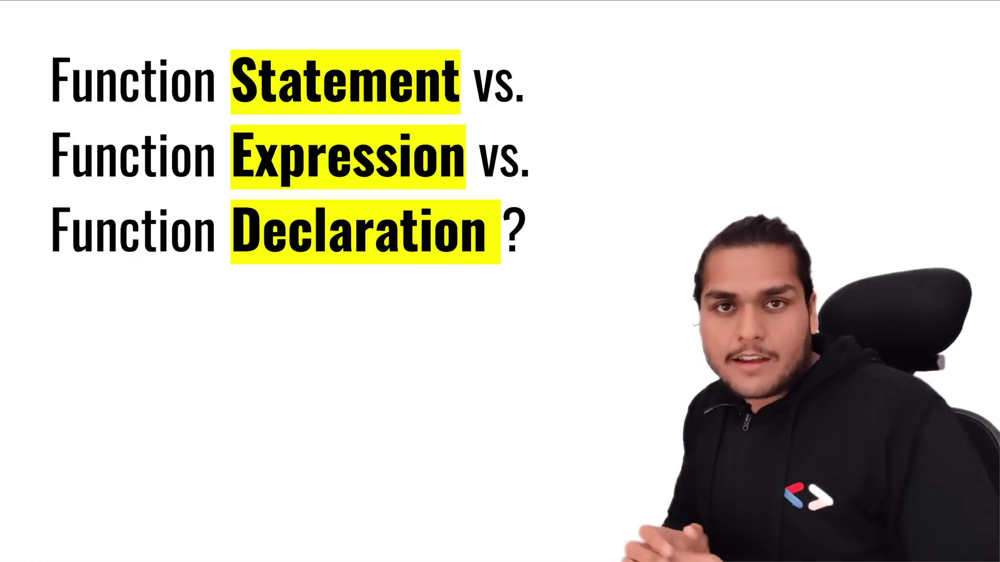
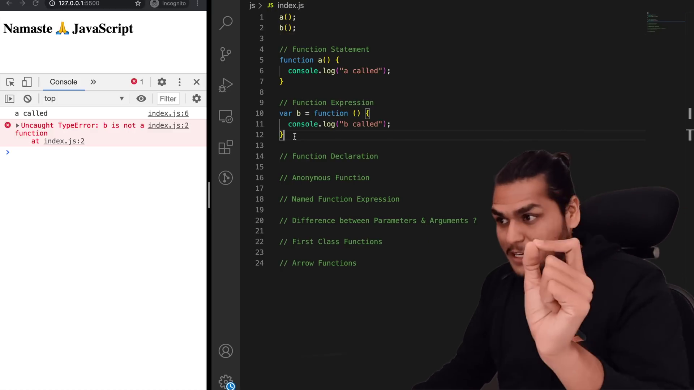
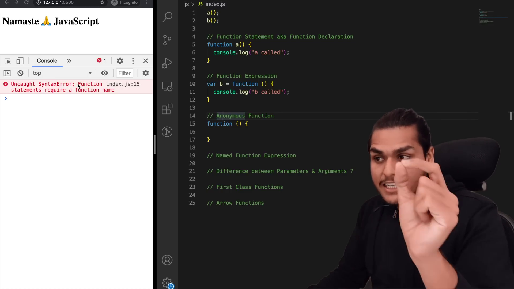
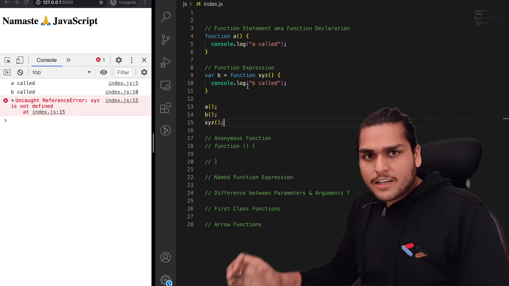
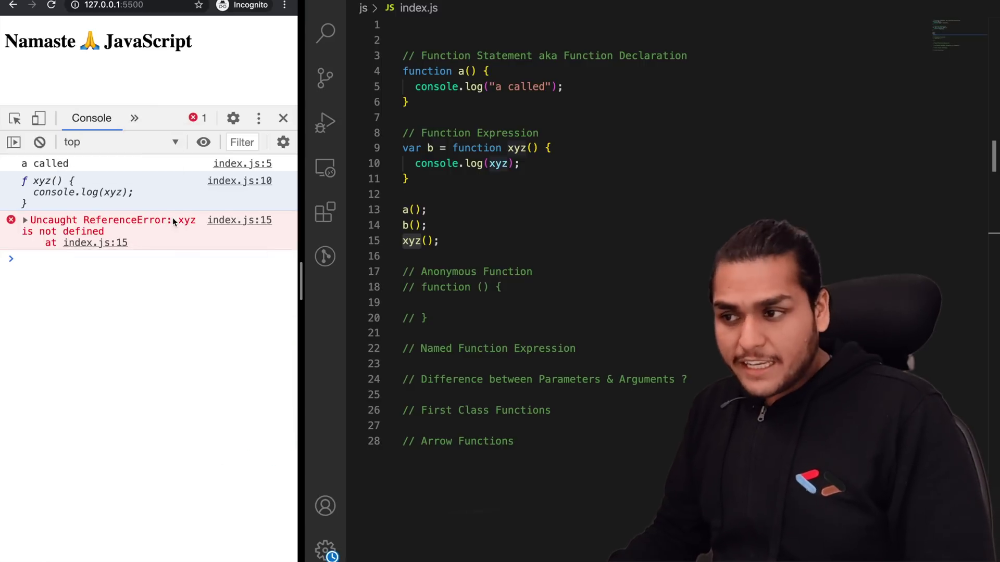

# FIRST CLASS FUNCTIONS 🔥ft. Anonymous Functions

- Functions are heart of JavaScript
- Functions statement & Functions Expression
  - Hoisting is different.

- Function statement also known as Function Declaration
- Anonymous Functions are useful where they are used as values
  - Function Expression

- Function Expression -> assigning Anonymous Function to variable
- NFE - Named Function Expression, assigning Function statement to variable

- First Class Function
  - passing function as argument to another functions
  - it is also known as First Class Citizen

