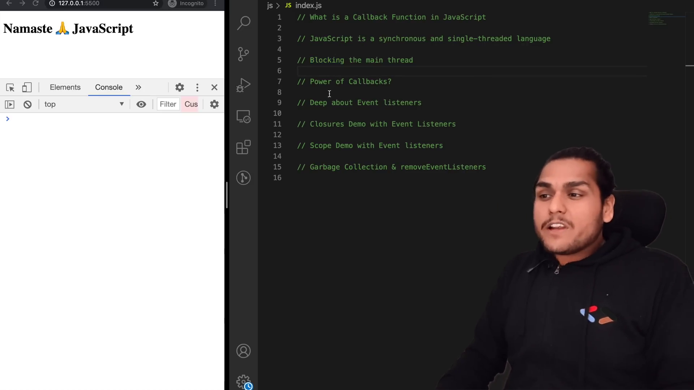
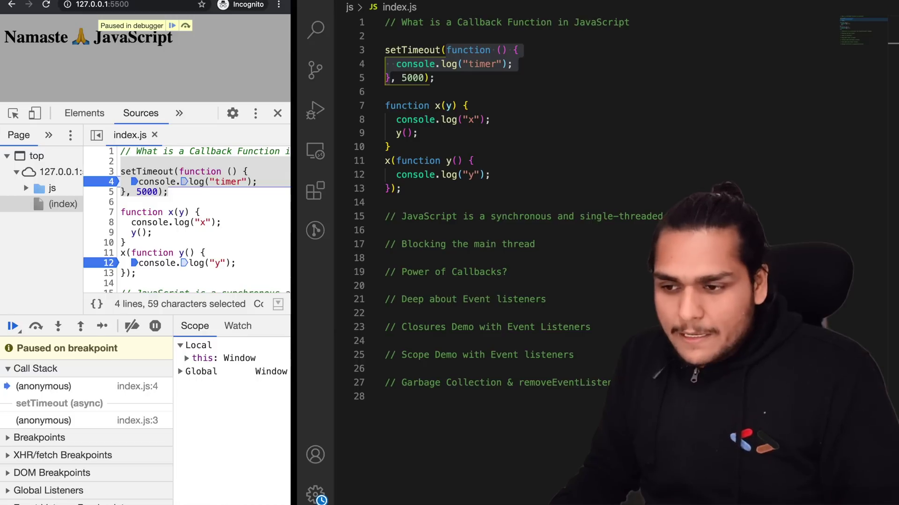

# Callback Functions in JS ft. Event Listeners 🔥

- Callback Functions

  - JS in Single threaded, Synchronous language. Due to Callback functions
    JS handles Asynchronous also.
  - it is called back in somewhere once the prior task finished. so it is
    called as Callback functions

- EventListeners are same like setTimeout, once the event is triggered it puts
  the callback function on callstack or main thread

- EventListeners are took so much memory, so we need to remove the EventListeners

