# Asynchronous JavaScript & EVENT LOOP from scratch 🔥

- if anything pushed into the call stack it runs immediatly, it will
  not wait for anything.

- **callback queue** -> where all the callback functions are queued here.
  - it is also called as **task queue**
- **event loop** -> continously check the callback queue, if any callback function found here, it immediatly push this into callstack.
- **microtask queue** it is similar to callback queue, but it has high priority than callback queue
  - Promises and Mutation Observer comes inside this queue

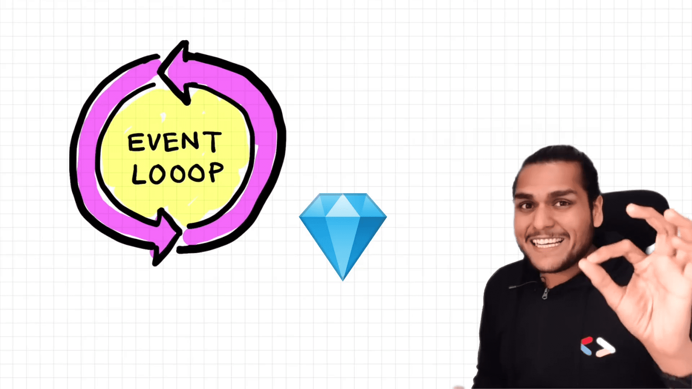
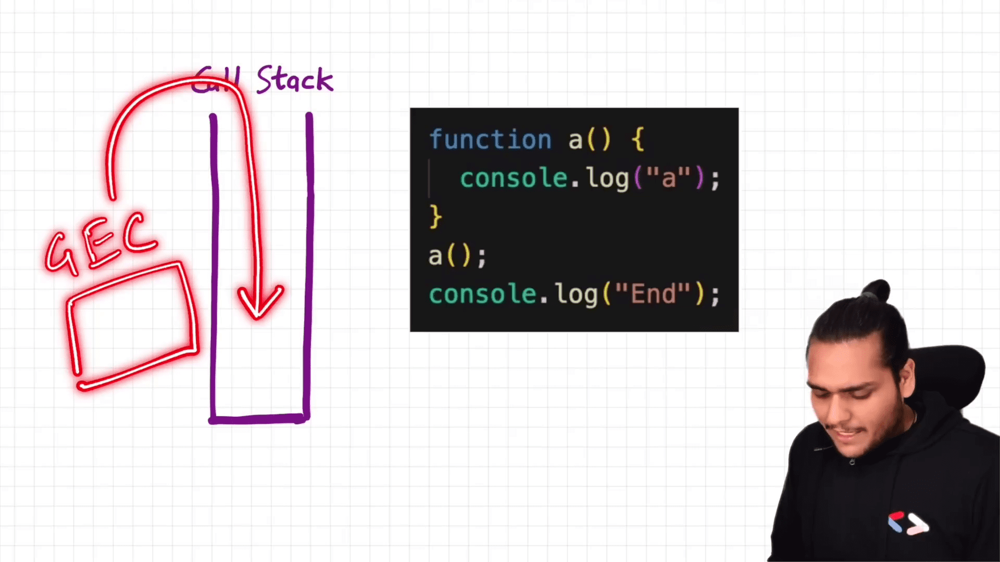
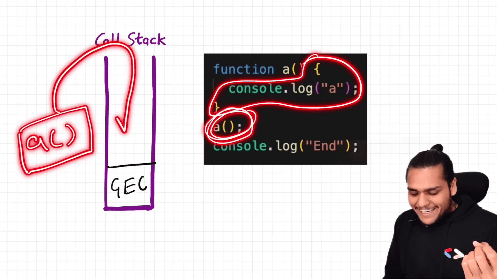
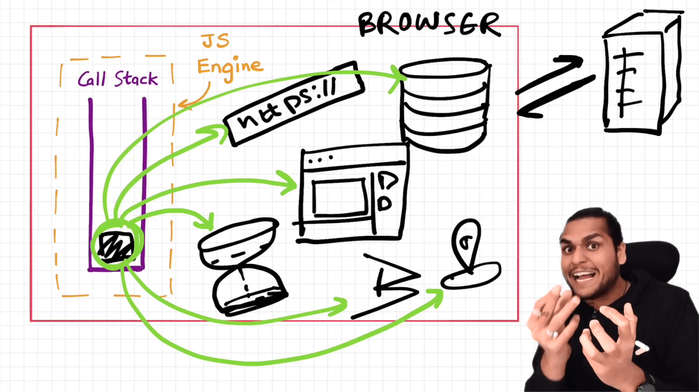
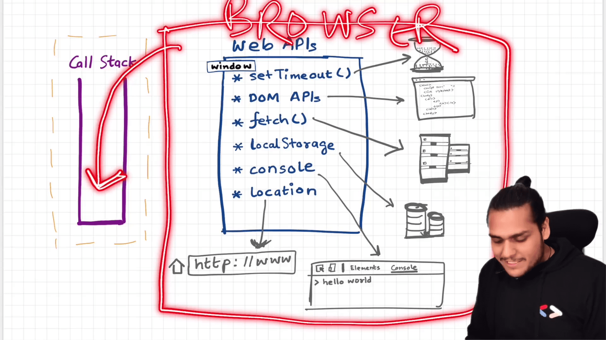
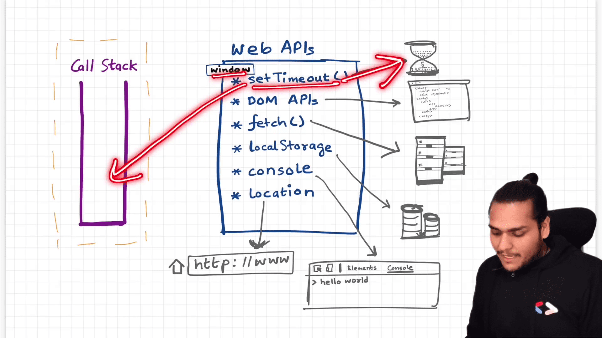
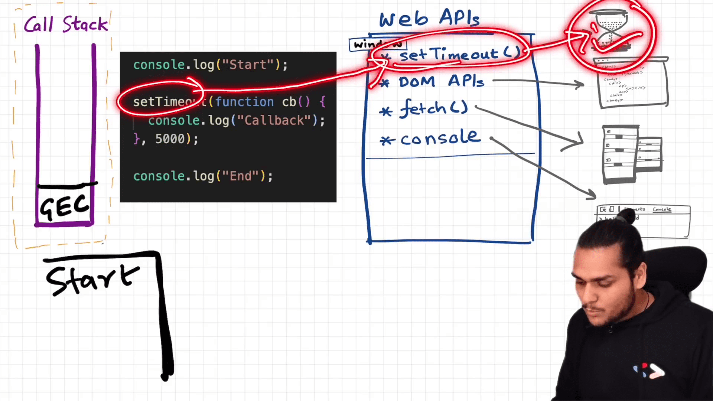
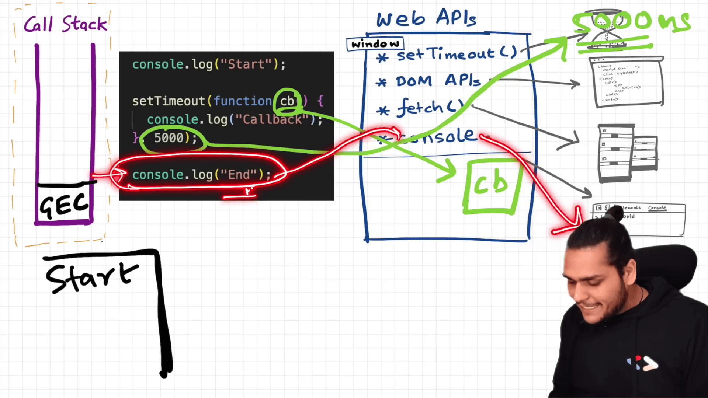
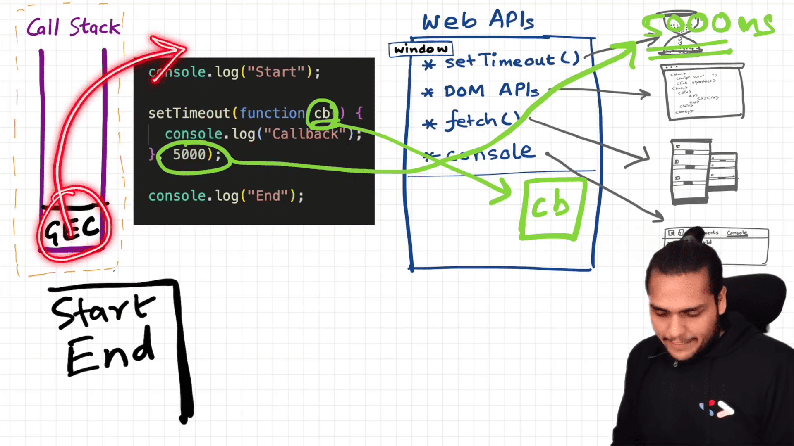
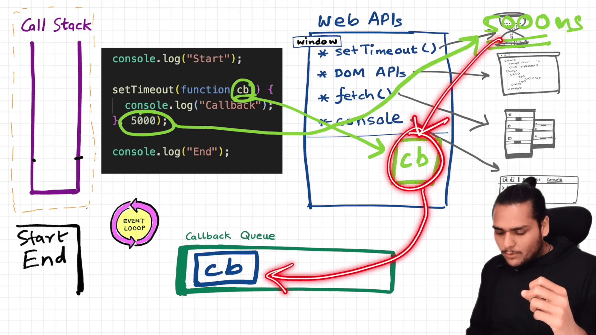
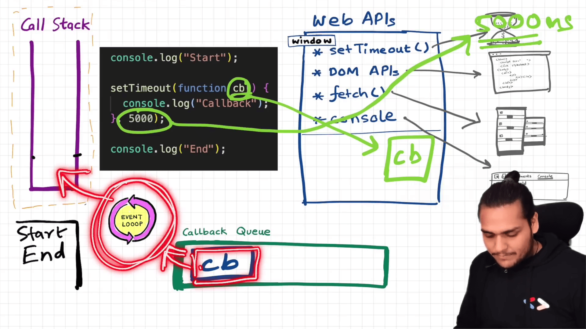
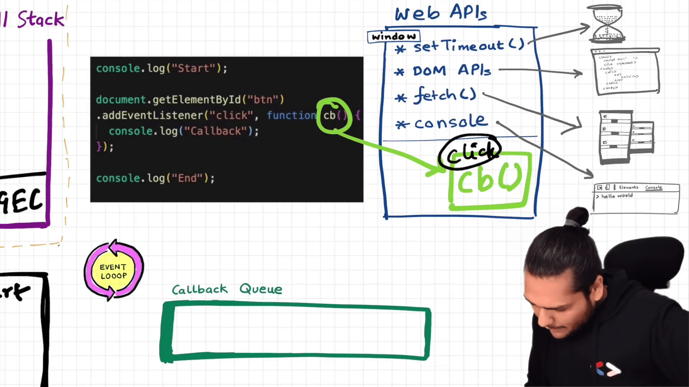
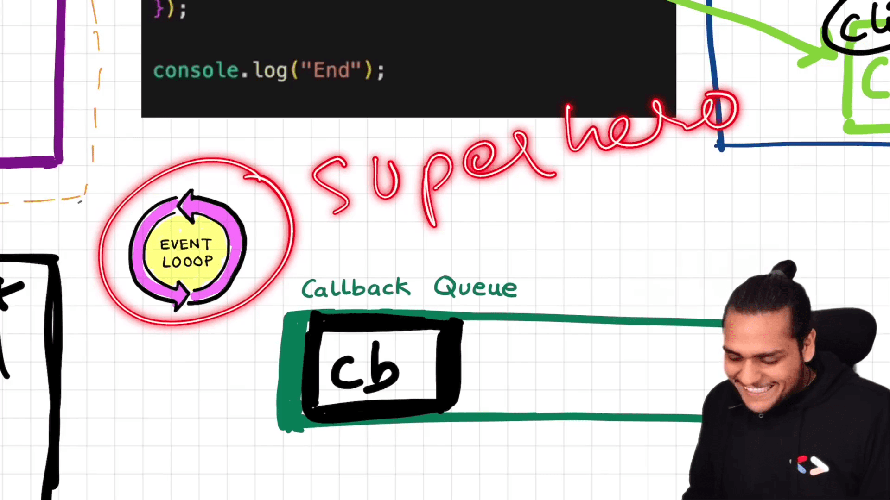

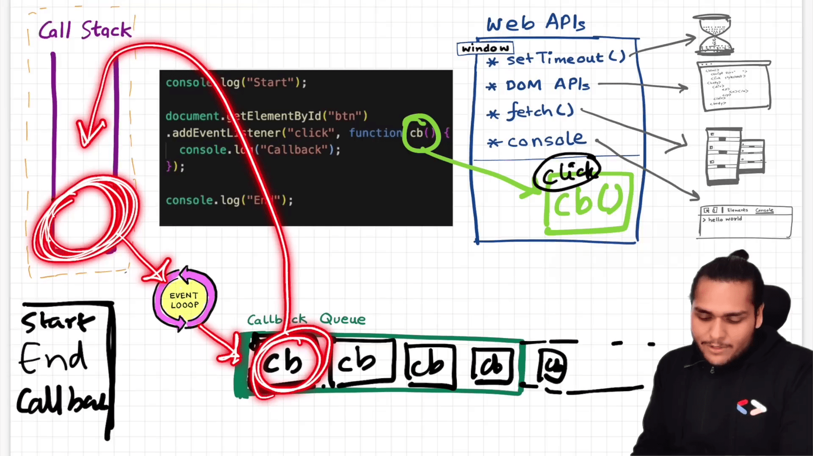
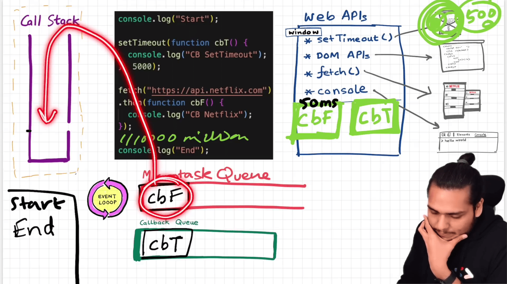
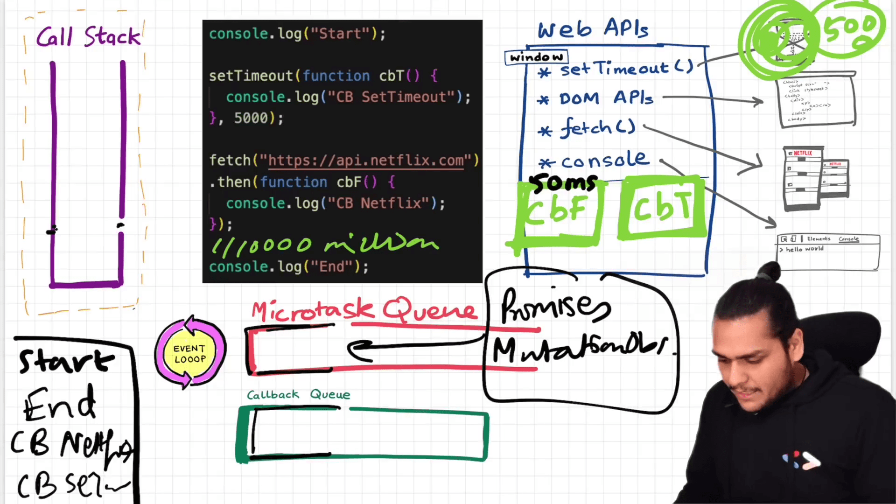
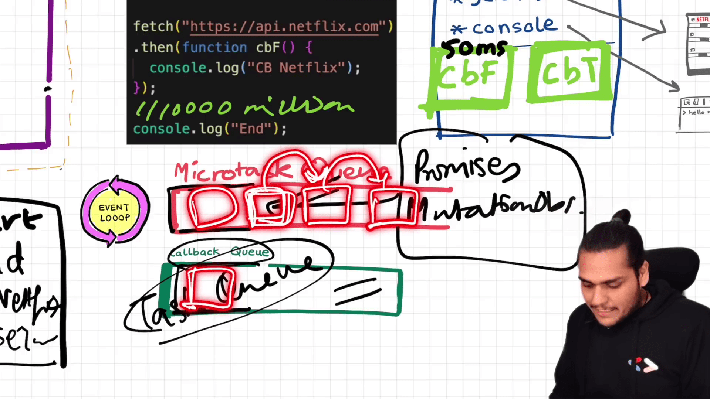
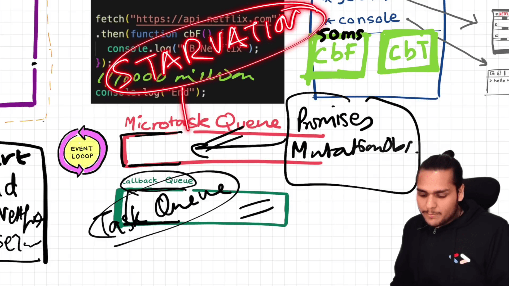
