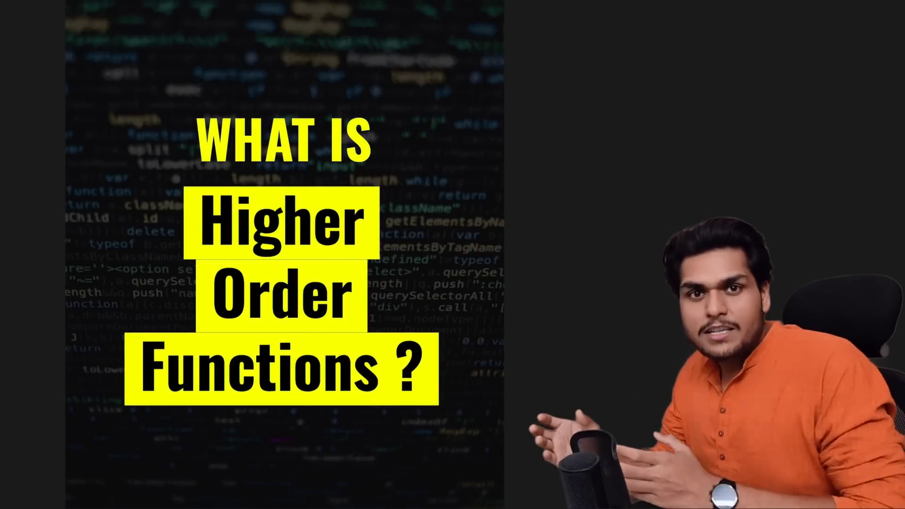
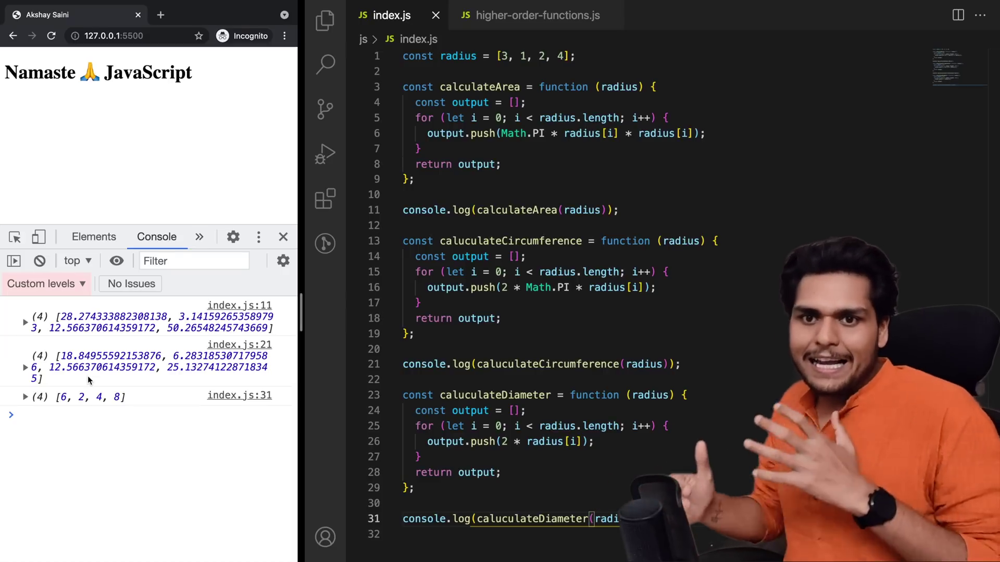
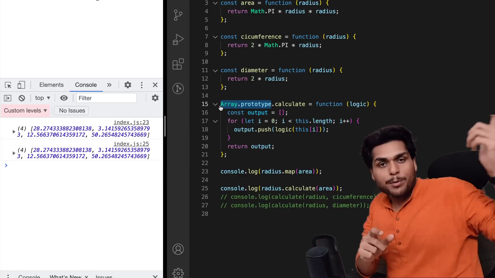

# Higher-Order Functions ft. Functional Programming

- A function which takes another function, or return a function is called
  higher order functions
- Functional Programming

  - modular, scalable, testable

- it reduces the code, and improves the developer thinking.'

