# How JavaScript Code is executed\_ ❤️& Call Stack

#### Phase 1 - memory creation

- JS allocates memory for variables and functions
- Variables stores **undefined** special value
- functions stores the function body, not **undefined**

#### Phase 2 - Code Execution

n = 2,
skip function, there is nothing to execute.

| In JS `functions` executes differently than other languages

whenever a function is invoked a `brand new Execution Context` is created.
once the function execution completed, the Execution Context is erased.

#### Call Stack

JS manages the Execution Context with the help **Call Stack**. Yes Stack Data Structure, Once Global Execution Context created it pushed to Call Stack, if another Execution Context created it pushed to Call Stack. once the 2nd Execution Context completed it removed from the Call Stack.

- Call Stack have different names

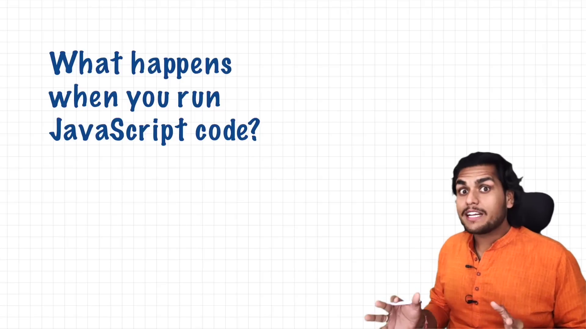
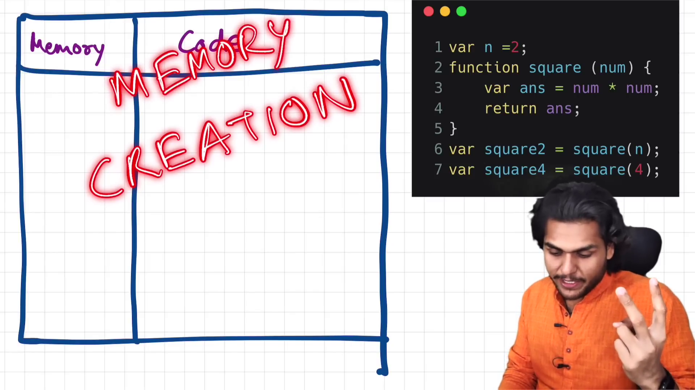
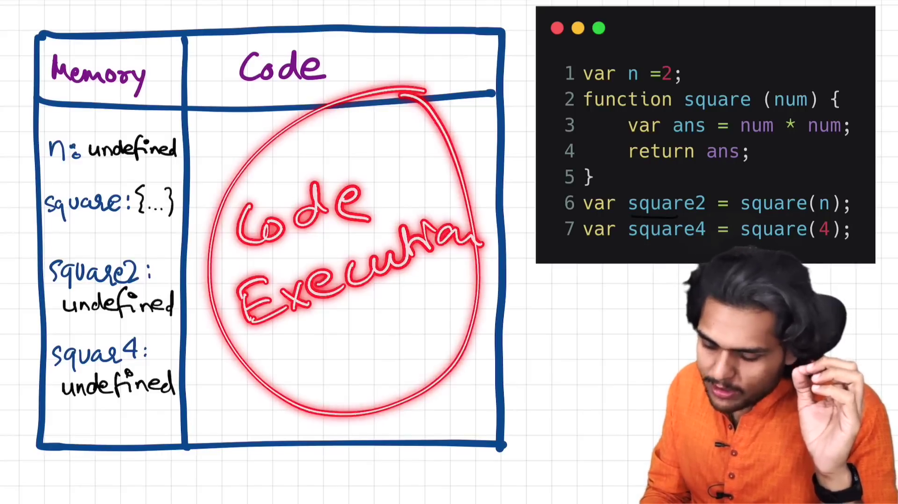
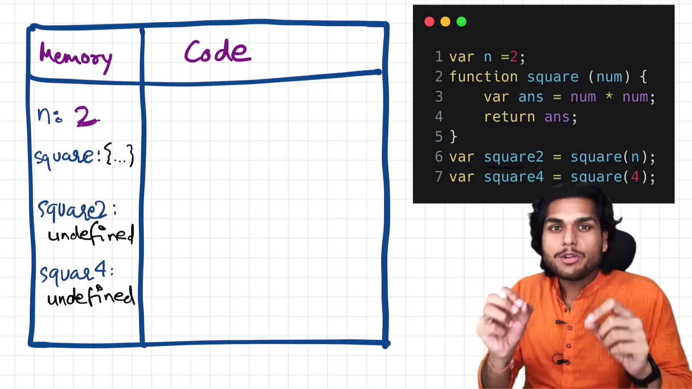
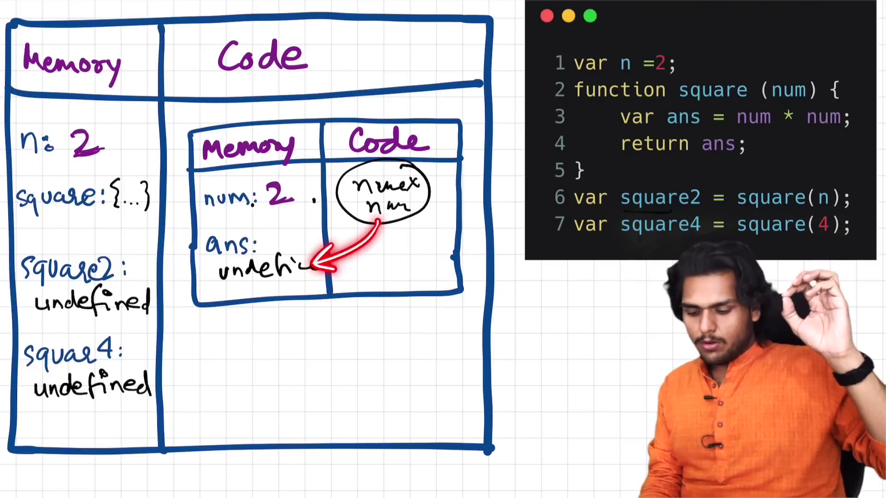
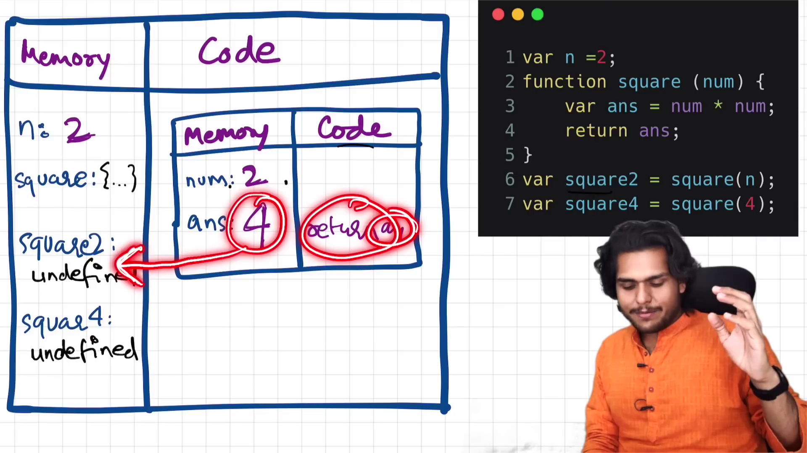
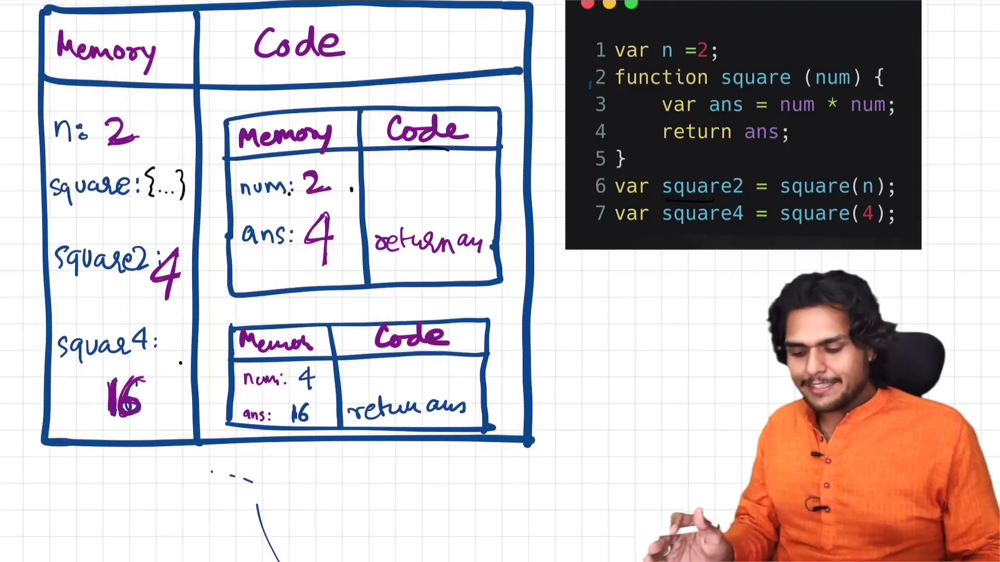
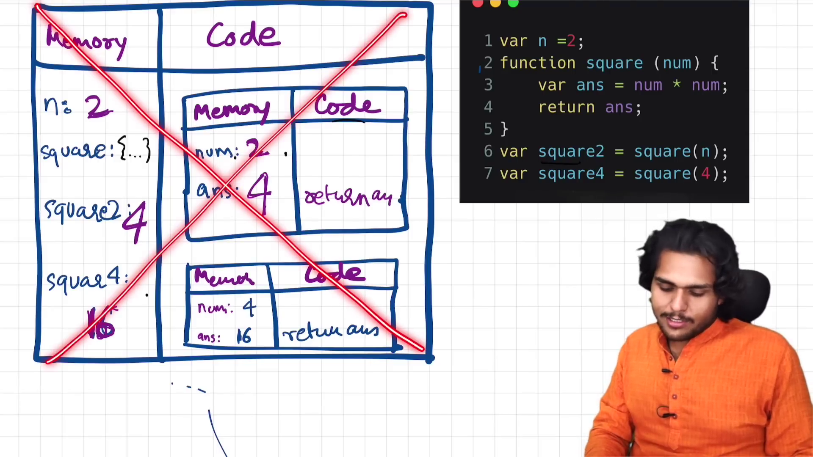
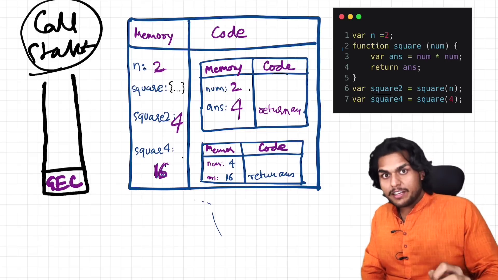
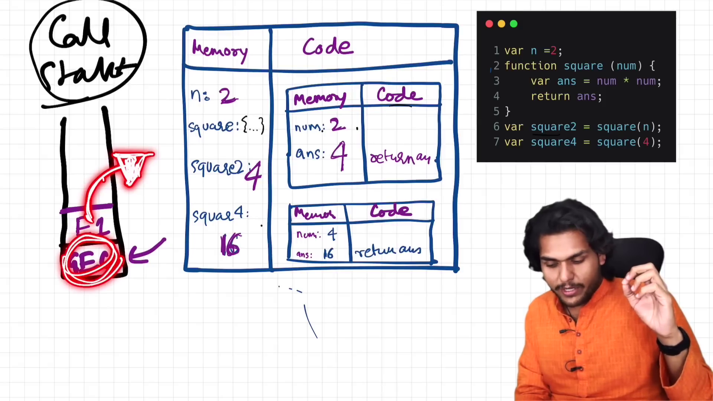
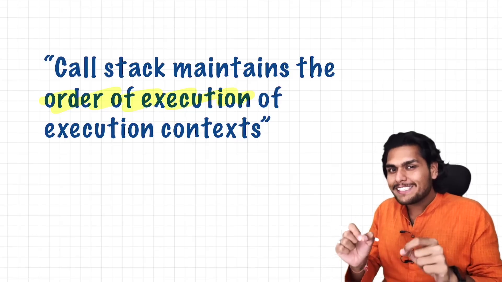
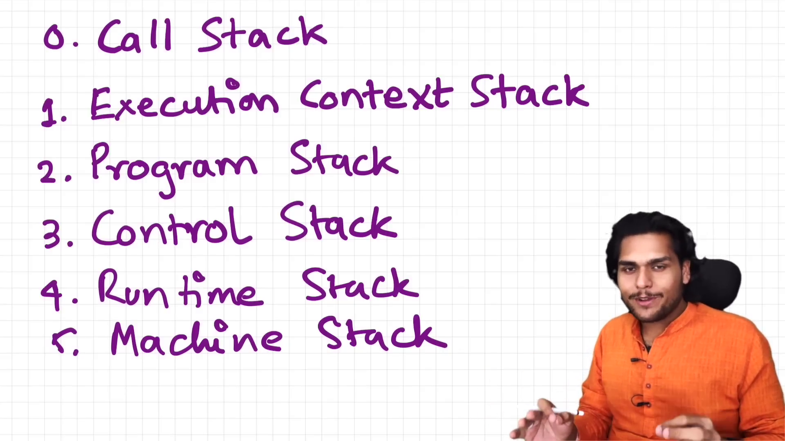