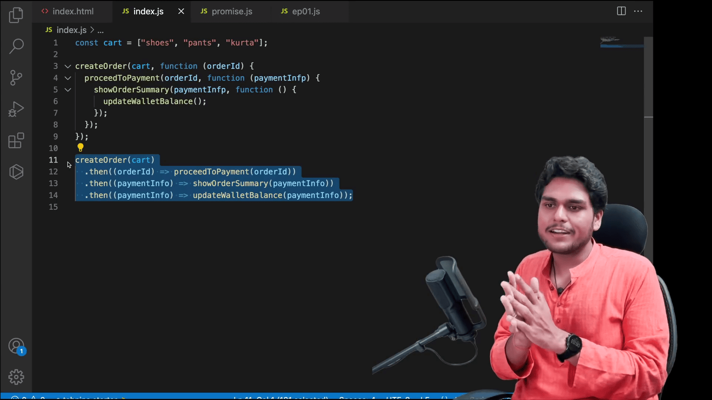

# Promises

- **Promises** reduces the Callback Hell, and removes the Inversion of Control means
  it gives the control over higher order functions

- with the help of Promises, high order functions don't need to run callback function, so Promises makes HOF has `Single Responsibilty Principle`.
- then we take the control of return value of HOF, then do whatever we want.
- Promise is immutable, so we don't need to worry and use it anywhere.

- Promise Definition:

  - Placeholder for value, which will be fullfilled in future.
  - Container for future value
  - A Promise is an Object representing eventual completion or failure of an
    asynchronous operation.

- Inversion of Control

  ```js
  function goToHotel(eat) {
    console.log("Hotel Arrived");
    foods = ["dosa", "idly"];

    eat(food);
    eat(food);
  }

  goToHotel(function (food) {
    console.log("Eating");
    console.log("Meals is Good");
  });
  ```

  here goToHotel function calls eat function twice, but we need one time to eat.
  And I only need meals to eat, not idly, dosa.

  here we don't have control over higher order function (goToHotel).
  but there is way we make the control only call the food have meals by wrapping
  into another function.

  ```js
  goToHotel(function (food) {
    const meals = false;
    food.forEach((element) => {
      if (element === "meals") {
        meals = true;
        break;
      }
    });

    if(meals){
      function(food){
        console.log("Eating");
        console.log("Meals is Good");
      }
    }
  });
  ```

  if another function need the hotel food value means we need to call the
  function, it breaks DRY principle. and goToHotel do two works which breaks
  Single Responsibilty Principle

  here we introduce Promise, which makes the callback

  1. readable
  2. maintainable, easy to debug
  3. reusable.

  ```js
  goToHotel().then(doWhatEverYouWantWithPromiseValue());
  ```



