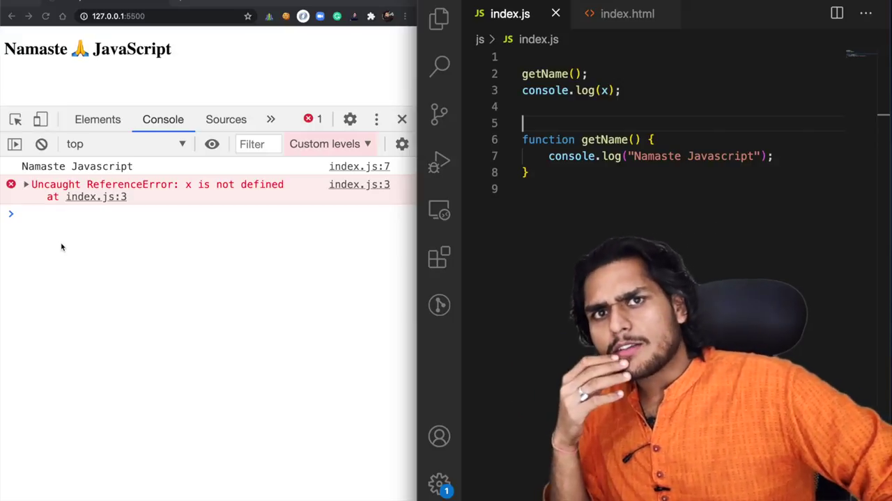

# Hoisting in JavaScript 🔥(variables & functions)

- If you try to access the variables before it initialled, it gives undefined values. but other languages throw error.
- this is called hoisting, JS behaves differently for variables and functions before it initialized and after initialization

- **undefined** - means no value defined for variable\
- **not defined** - variable itself not defined in Execution Context

- In memory creation phase normal function get the value of function itself, so in program we call it before it was defined.
- but Arrow function and function expression behaves like variable, it holds **undefined** at initial phase, not the function itself.

