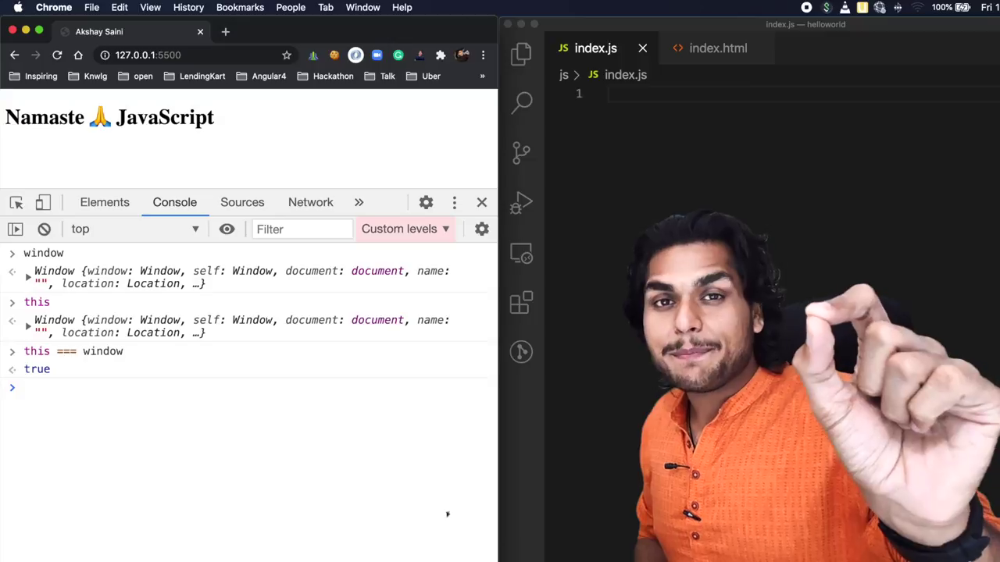
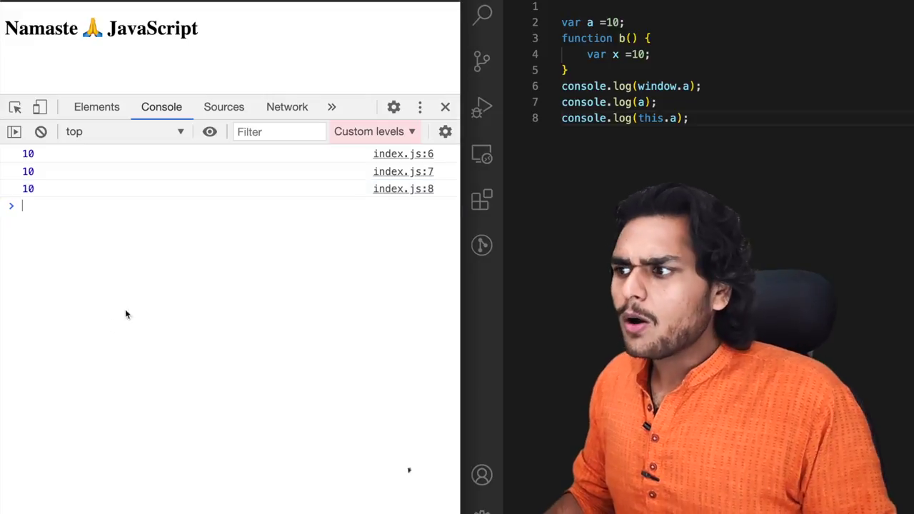

# SHORTEST JS Program 🔥window & this keyword

- the shortest JS program is Empty file
- JS Engine creates EC with empty file also

- **window** is a global object it created along with the GEC.
- **this** also created with GEC.

- **global space** where all the variables and functions stored. but variables inside a functions is not global. because variable inside a function is isolated from the outer space of the global space.

