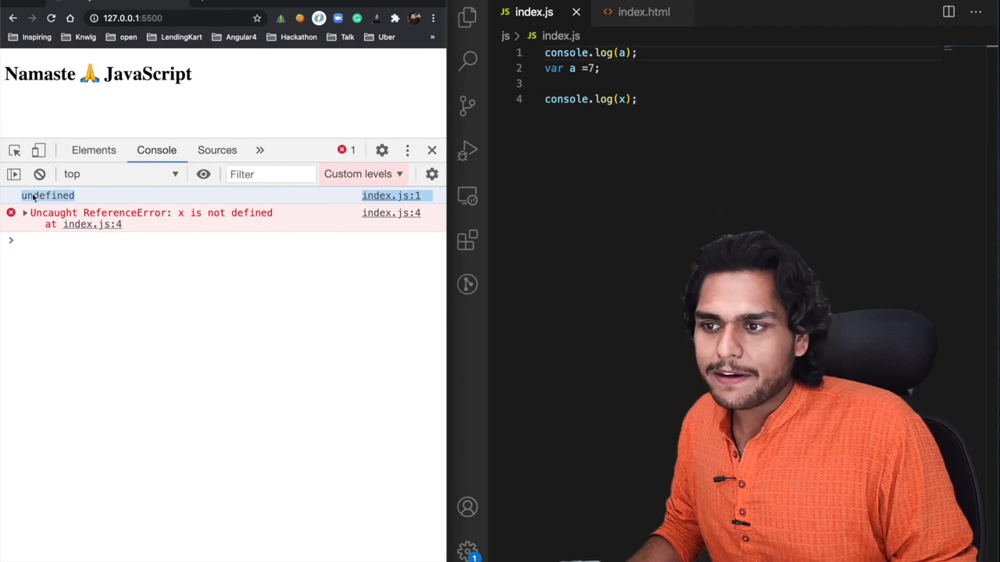
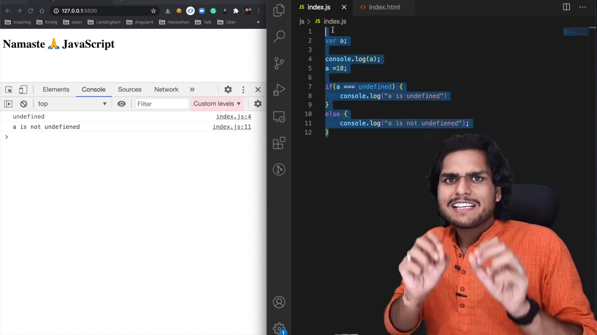
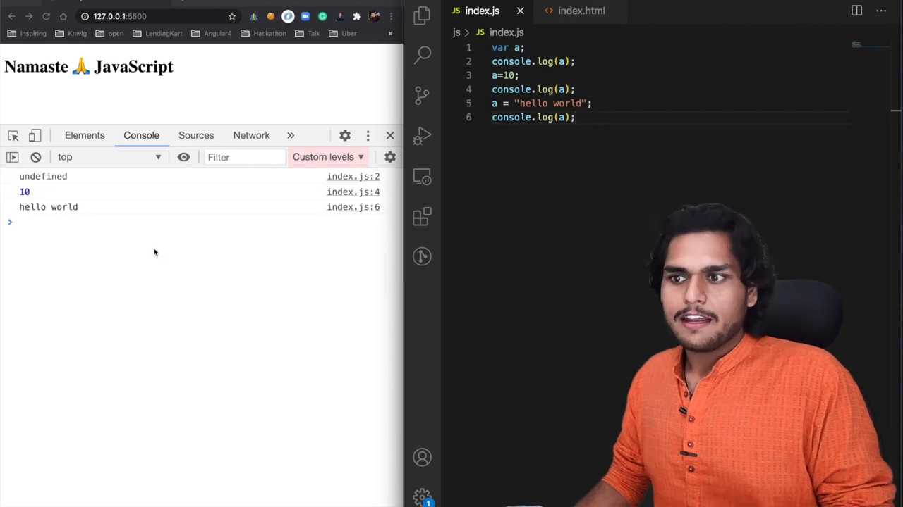

# undefined vs not defined in JS 🤔

- **undefined** is special placeholder for variable until it executed. it doesn't mean no value.

- don't assign undefined in any variable explicitly. because it is not semantic and not consistent. if you put undefined to variable it looses the meaning.
  ```javascript
  var a = 10;
  a = undefined;
  ```



