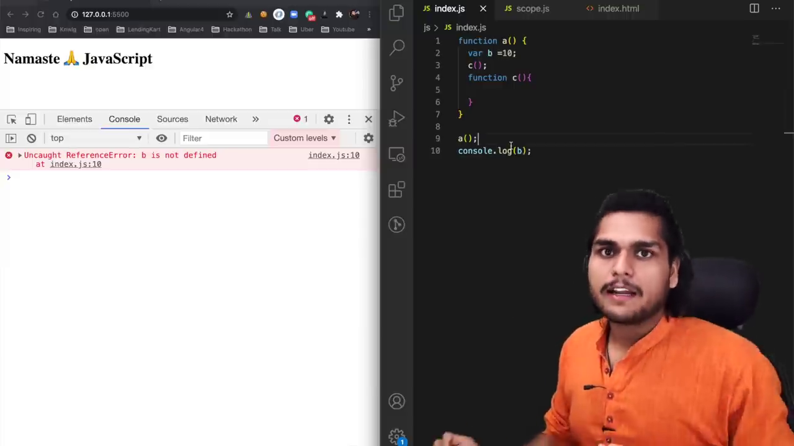
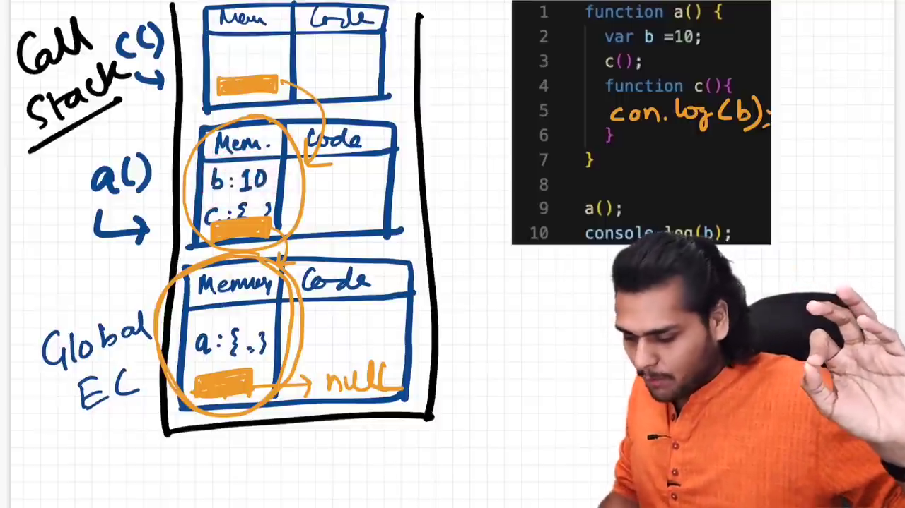
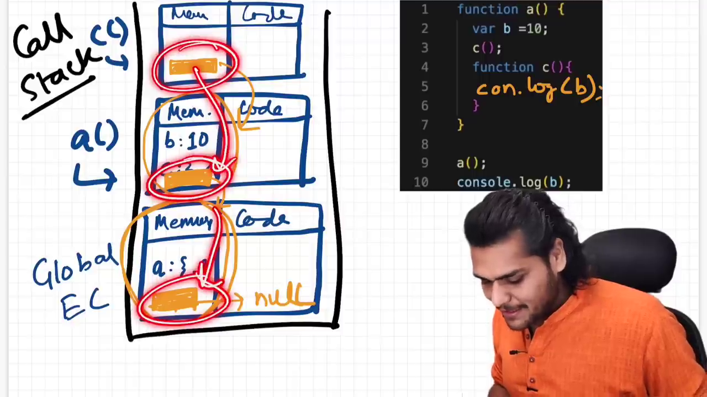
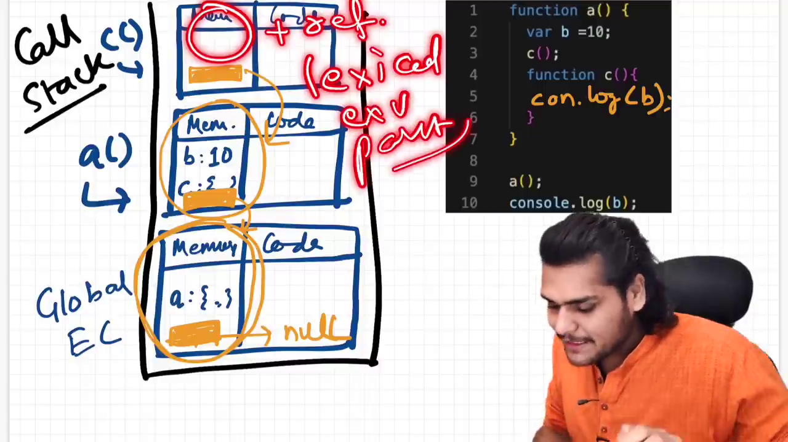
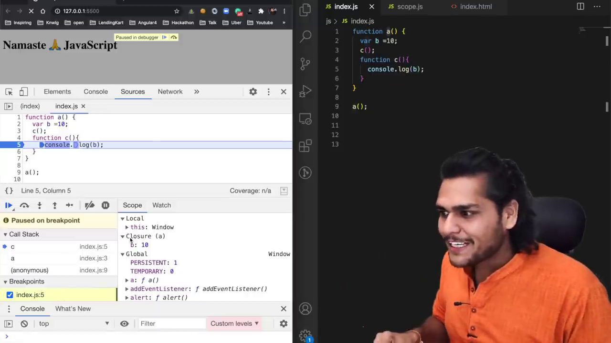

# The Scope Chain, 🔥Scope & Lexical Environment

- **Scope** is where you can access specific variable and functions.
- which variable is accessible and upto which point it is accessible.
- Scope is directly depend on **Lexical Environment**
- **Lexical Environment** is the local memory along with its parent Lexical Environment
- **Lexical** is means in order or in hierarchy, hence Lexical Environment means how those Environment are order in call stack
- **Scope Chain** - searching for variable in upper scope is called Scope Chaining.

  ```js
  function global() {
    function insider() {
      console.log(variable);
    }
    insider();
  }

  variable = "SCOPE";
  global();
  ```

  1. insider function doesn't have variable,
  2. so it searches to parent Lexical Environment, here is also there is no variable
  3. so it searches to that parent, here it founds the variable.







