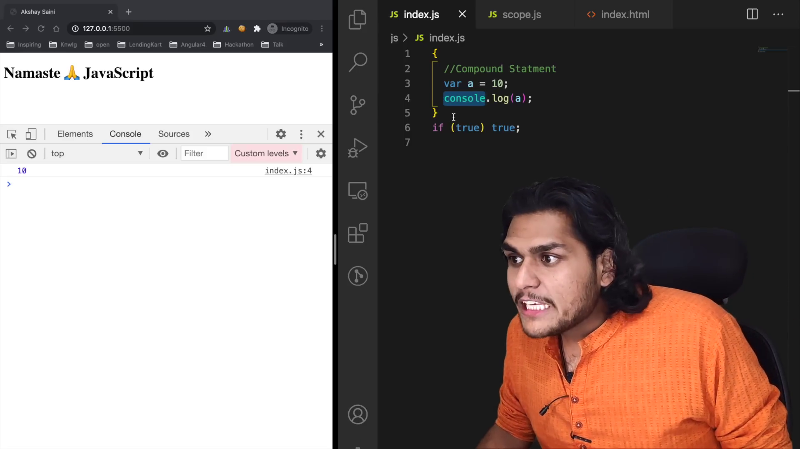
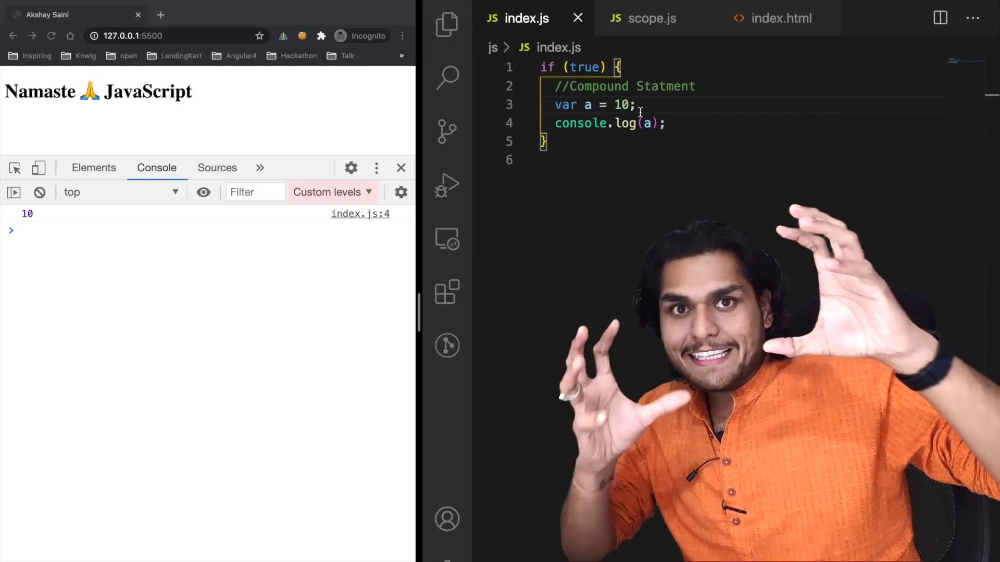
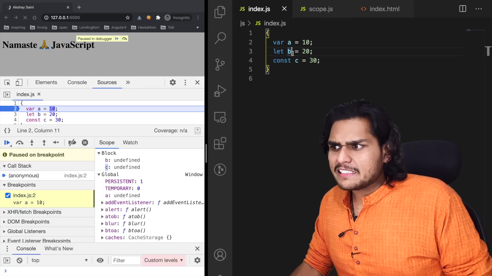
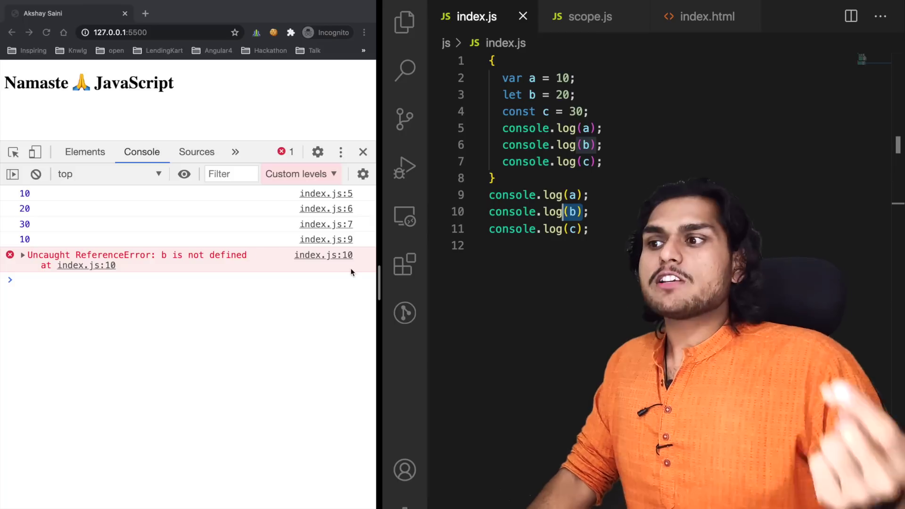
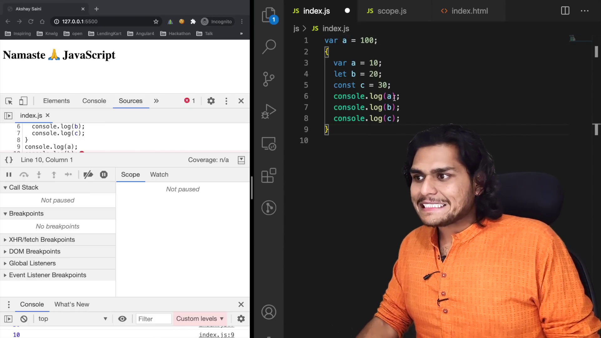
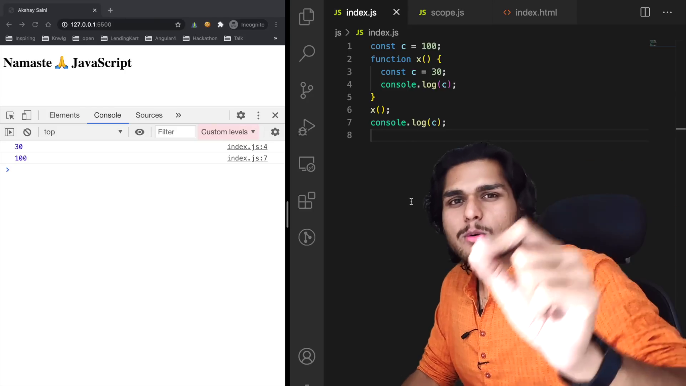
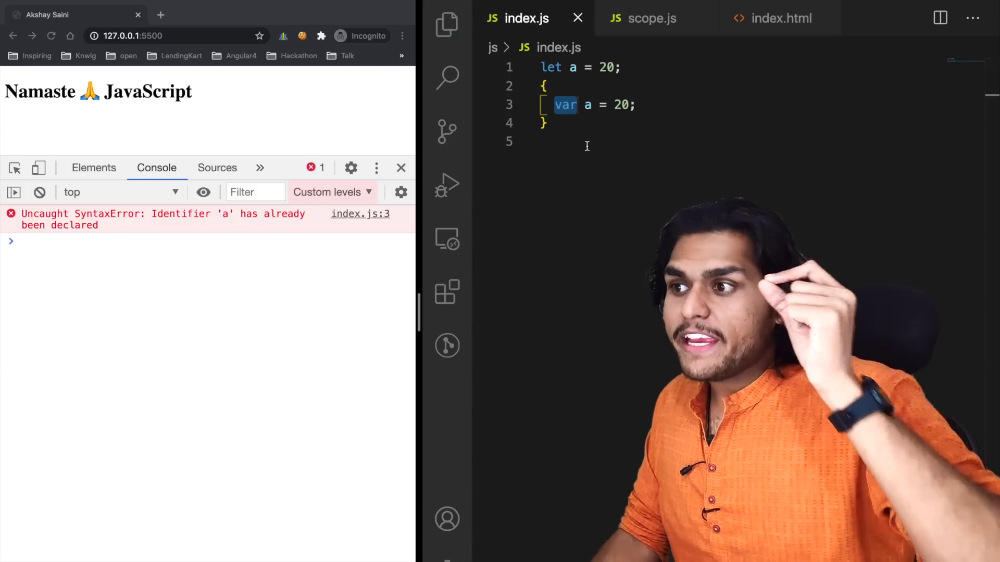
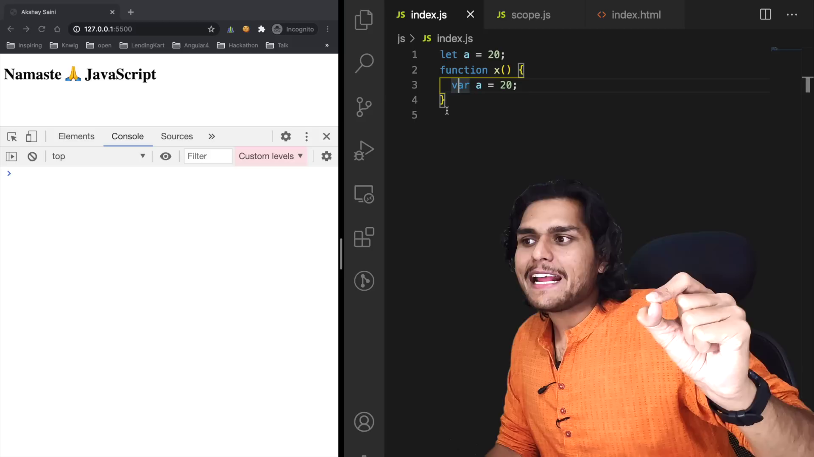
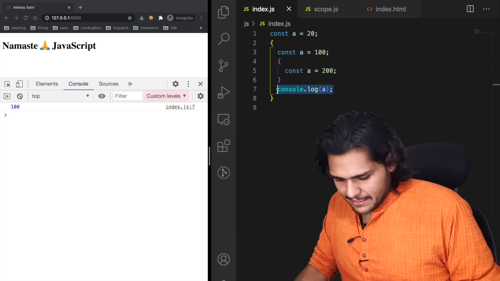

# BLOCK SCOPE & Shadowing in JS 🔥

- {} is used to create Block Scope, it is also known as **Compount Statements**
- it is used to combine multiple statements, so we can use it where JS need single statement.
- **Block Scope** is where we can access variables and functions inside a block statement
- Once the block is executed, the block scope get removed from the Environment Context.
- **Shadowing** - shadowing occurs when a variable declared in a certain scope (e.g. a local variable) has the same name as a variable in an outer scope (e.g. a global variable). When this happens, the outer variable is said to be shadowed by the inner variable. var overwrites the value if it is in same Execution Context

